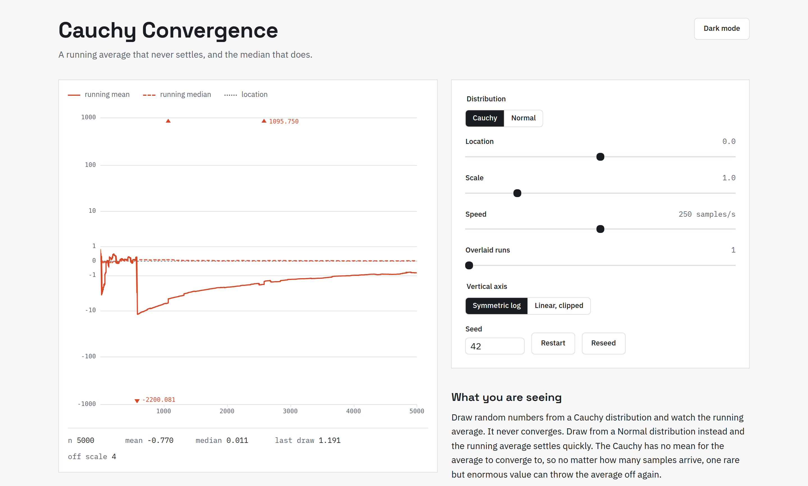
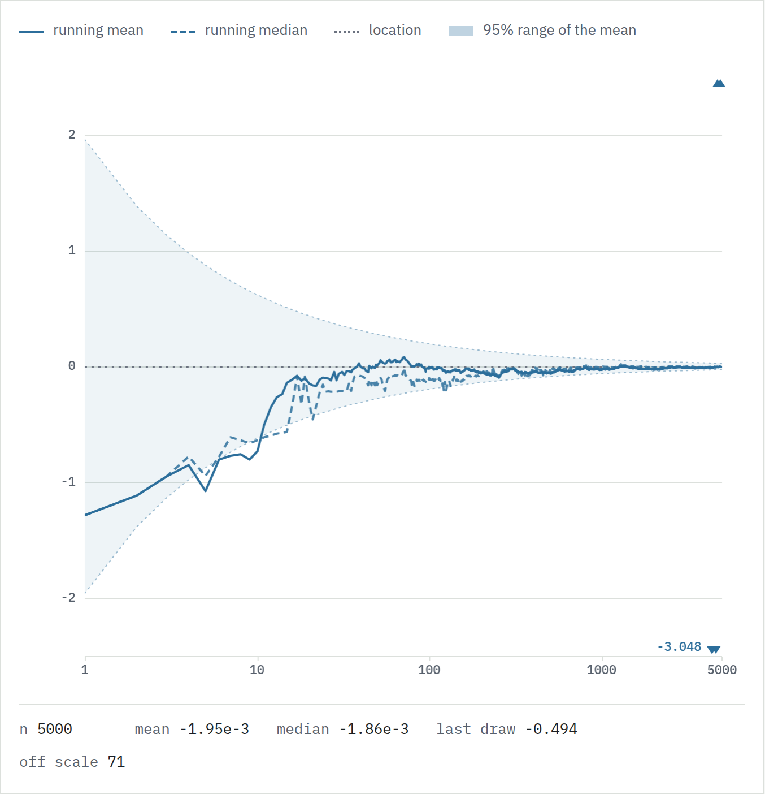

# Cauchy Convergence

An interactive look at a distribution that breaks a rule most people take for granted: the average of many samples does not always settle down.



## What it shows

Draw random numbers from a Cauchy distribution and watch the running average. It never converges. Draw from a Normal distribution and the running average settles quickly. The Cauchy has no mean for the average to converge to, so no matter how many samples you take, one rare but enormous value can throw the average off again. The running median, on the other hand, does settle, because the median is a stable estimate of where the distribution is centered.

In Normal mode the chart switches to a logarithmic sample axis and draws the 95 percent band for the running mean, which tightens like one over the square root of n while the trace threads it. The Cauchy chart has no band to draw, because the Cauchy has no variance.



## Why it happens

The Cauchy distribution has no defined mean or variance, so the Law of Large Numbers does not apply. There is also a cleaner way to say it: the average of n independent Cauchy samples has the exact same Cauchy distribution as a single sample. Averaging buys you nothing. The median is different, and it converges to the location parameter.

## Using it

Toggle between Cauchy and Normal. Adjust the location and scale. Change the animation speed. Restart replays the current seed from sample one, Reseed picks a fresh seed, and typing a seed into the box reproduces a run exactly. Switch the vertical axis between symmetric log and clipped linear, where off-scale values are pinned to the edge and annotated with their actual size. Turn on multiple overlaid runs to confirm the mean's wandering is not a one-off. A button in the header switches light and dark themes. Finished runs pause briefly and then replay the same seed, so the chart keeps moving while you read.

## Running locally

```
npm install
npm run dev
```

npm run build type-checks and produces the static site in dist. npm run test runs the unit tests for the sampling, running statistics, and scale modules.

## How it is built

React, Vite, and TypeScript. The chart is drawn on a canvas with a requestAnimationFrame loop for smooth streaming. D3 is used only for scales and axes. Randomness comes from a small seeded generator so runs are reproducible. Math is typeset with KaTeX.

## Notes

This is a teaching demo, not a research tool. Single Cauchy draws can be astronomically large, so the vertical axis uses a symmetric-log scale by default and marks values that fly off the chart rather than hiding them. The seeded generator is fine for a visualization but is not cryptographically secure.

## Credits

Built by [Cameron Scarpati](https://github.com/CameronScarpati) as a portfolio project. To go deeper, start with the [Cauchy distribution](https://en.wikipedia.org/wiki/Cauchy_distribution) and the [Law of Large Numbers](https://en.wikipedia.org/wiki/Law_of_large_numbers).

## License

MIT
